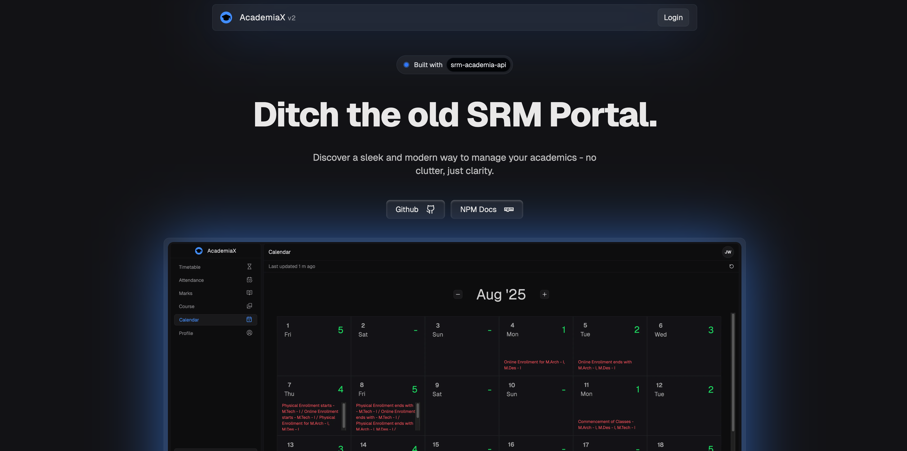

# AcademiaX v2

A modern, sleek web application that provides a better alternative to the traditional SRM Portal for managing academic information.



## Features

- **Timetable Management** - View and manage your class schedule
- **Attendance Tracking** - Monitor your attendance records
- **Course Information** - Access detailed course materials and information
- **Marks & Grades** - View your academic performance
- **Calendar Integration** - Academic calendar with important dates
- **Profile Management** - Personal academic profile
- **Secure Authentication** - Safe login and logout functionality
- **Responsive Design** - Works seamlessly on desktop and mobile devices
- **Modern UI/UX** - Clean, intuitive interface with smooth animations

## Tech Stack

- **Framework**: Next.js 15 with App Router
- **Language**: TypeScript
- **Styling**: Tailwind CSS v4
- **State Management**: Zustand
- **Data Fetching**: TanStack Query (React Query)
- **Icons**: Lucide React & React Icons
- **API**: srm-academia-api package
- **Authentication**: Cookie-based auth with js-cookie
- **Development**: ESLint, Turbopack

## Installation

1. **Clone the repository**

   ```bash
   git clone https://github.com/jackwaghan/academiax.git
   cd academiax
   ```

2. **Install dependencies**

   ```bash
   bun install
   ```

3. **Run the development server**

   ```bash
   bun dev
   ```

4. **Open your browser**
   Navigate to [http://localhost:3000](http://localhost:3000) to see the application.

## Project Structure

```
academiax/
├── src/
│   ├── app/                    # Next.js App Router
│   │   ├── app/               # Main application routes
│   │   │   ├── attendance/    # Attendance tracking
│   │   │   ├── calendar/      # Academic calendar
│   │   │   ├── course/        # Course information
│   │   │   ├── marks/         # Grades and marks
│   │   │   ├── profile/       # User profile
│   │   │   ├── timetable/     # Class schedule
│   │   │   └── components/    # Shared components
│   │   ├── auth/              # Authentication pages
│   │   └── components/        # Global components
│   ├── hooks/                 # Custom React hooks
│   ├── server/                # Server actions
│   └── utils/                 # Utility functions
├── public/                    # Static assets
└── package.json              # Dependencies and scripts
```

## 🎯 Key Features Explained

### Modern Dashboard

- Clean interface that replaces the traditional SRM Portal
- Real-time data updates with React Query
- Responsive design that works on all devices

### Academic Management

- **Timetable**: View your daily class schedule with ease
- **Attendance**: Track your attendance percentage across all courses
- **Marks**: Monitor your academic performance and grades
- **Courses**: Access detailed course information
- **Calendar**: Academic calendar with important dates and events
- **Profile**: Academic Student information

## 🔧 Available Scripts

- `npm run dev` - Start development server with Turbopack
- `npm run build` - Build the application for production
- `npm run start` - Start the production server
- `npm run lint` - Run ESLint for code quality

## 🌐 API Integration

This application uses the `srm-academia-api` package to interact with SRM University's backend services. The API provides secure access to:

- Student authentication
- Academic data retrieval
- Real-time updates

## 📄 License

This project is licensed under the Creative Commons Attribution 4.0 International License - see the [LICENSE-CC-BY-4.0](LICENSE-CC-BY-4.0) file for details.

## 🔗 Links

- **GitHub Repository**: [https://github.com/jackwaghan/academiax](https://github.com/jackwaghan/academiax)
- **NPM Package**: [https://www.npmjs.com/package/srm-academia-api](https://www.npmjs.com/package/srm-academia-api)
- **AcademiaX**: [https://academiax.in](https://academiax.in)

## Environment variables

The app expects the following environment variables for payment integrations. Make sure to set these in your deployment or local environment (for example in Vercel, Koyeb, or a .env file used by your runtime):

- `PAYMENT_LINK` - Base URL of the external payment service used by the app (e.g. `https://payments.example.com`). If not set, the app will skip payment checks to avoid runtime errors.
- `RAZORPAY_KEY_ID` and `RAZORPAY_KEY_SECRET` - Credentials used when creating Razorpay payment links. Keep these secret.

Example (local .env):

```
PAYMENT_LINK=https://payments.example.com
RAZORPAY_KEY_ID=rzp_test_xxx
RAZORPAY_KEY_SECRET=yyy
```
